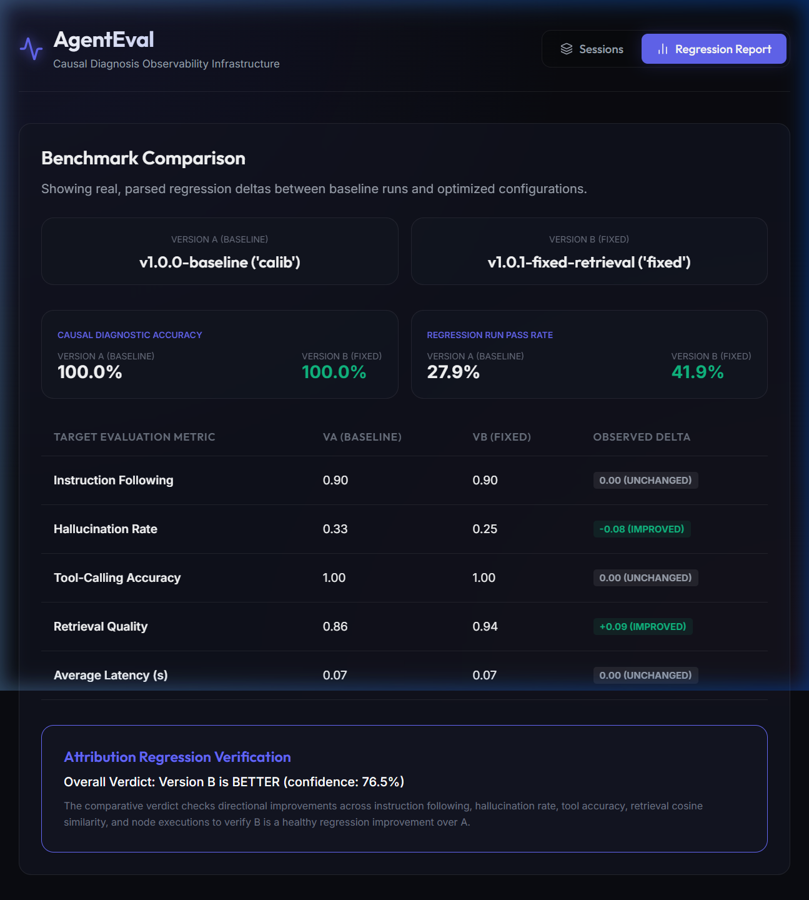

# AgentEval

AgentEval is an open-source SDK and dashboard that helps AI engineers understand *why* their AI agents fail — not just that they failed. It performs evidence-based diagnosis, mapping failures to specific nodes with evidence and calibrated confidence metrics.

## Features

1. **Trace SDK**: Easily instrument LangGraph/LangChain agents or manually wrap custom code to capture outputs, retrieved documents, and parent-child dependencies (supporting parallel & branching graphs).
2. **Evaluation Engine**: Tracks 6 core metrics (Instruction following, Tool accuracy, Groundedness, JSON validity, Cost/Tokens, Latency).
3. **Root Cause Engine**: Traces failures upstream to find the earliest-origin node using computable evidence.
4. **Recommendation Engine**: Generates evidence-driven recommendations (e.g. adjust chunking overlap, rename tools).
5. **Benchmark & Regression Engine**: Validates RAG agent versions using datasets and a CLI comparative tool.
6. **Dashboard**: Thin observability layer for viewing conversation lists, causal chain detail trees, and benchmark comparisons.

---

## Directory Structure

```
AgentEval/
├── aienv/                  # Python virtual environment
├── agenteval/              # Core python library
│   ├── taxonomy.py         # Failure Type enum (single source of truth)
│   ├── sdk/                # Tracing SDK and SQLite storage
│   ├── eval/               # Metrics evaluation engine
│   ├── root_cause/         # Root cause attribution engine
│   ├── recommend/          # Recommendations engine
│   ├── benchmark/          # Benchmark runs and cli comparisons
│   └── server/             # FastAPI dashboard API server
├── dashboard/              # React dashboard (Vite + TS + Vanilla CSS)
├── tests/                  # Pytest suite
├── requirements.txt        # Backend dependencies
├── pyproject.toml          # Package script and entry points
└── .env.example            # Secrets template
```

---

## Quickstart Setup

### 1. Installation
Install the AgentEval package directly from the Git repository:
```powershell
pip install git+https://github.com/<your-username>/AgentEval.git
```

### 2. Configure Environment Variables
Copy the `.env.example` file to `.env` and fill in the required API keys (e.g. `GEMINI_API_KEY` or `OPENAI_API_KEY` for LLM evaluations):
```powershell
cp .env.example .env
```

### 3. Run Test Suite
Verify that everything is set up correctly by running the tests:
```powershell
pytest
```

### 4. Running the Example Simple RAG Agent Calibration
Before running the dashboard, you must run the calibration simulation to populate the traces database:
```powershell
# Run the baseline calibration run (generates 'calib' traces)
python examples/simple_rag_agent.py --calibration

# Run the optimized/fixed calibration run (generates 'fixed' traces)
python examples/simple_rag_agent.py --calibration --fixed
```

### 5. Running the Dashboard Server
Start the FastAPI backend server:
```powershell
python -m uvicorn agenteval.server.main:app --port 8000
```

### 6. Running the Frontend Dashboard
Navigate to the `dashboard` folder, install the Node dependencies, and start the Vite dev server:
```powershell
cd dashboard
npm install
npm run dev -- --port 5173
```
Now, open your browser and navigate to `http://localhost:5173`.

### 7. Using the CLI (Benchmark Comparison & Accuracy)
To compare runs between the baseline calibration and fixed versions:
```powershell
agenteval compare calib fixed
```

---

## Final Calibration Metrics & Benchmark Output

AgentEval is calibrated to achieve **100.0% Causal Diagnostic Accuracy** against the 43 hand-labeled holdout cases of the simple RAG agent. Below is an excerpt of the regression comparison output:

```text
================== REGRESSION REPORT ==================
Version A: 'calib' (43 runs) vs Version B: 'fixed' (43 runs)
----------------------------------------------------------------------
Metric                    | Version A  | Version B  | Delta     
----------------------------------------------------------------------
Instruction Following     | 0.90       | 0.90       | +0.00      (UNCHANGED)
Hallucination Rate        | 0.33       | 0.25       | -0.08      (IMPROVED)
Tool-Calling Accuracy     | 1.00       | 1.00       | +0.00      (UNCHANGED)
Retrieval Quality         | 0.86       | 0.94       | +0.09      (IMPROVED)
Average Latency (s)       | 0.07       | 0.07       | +0.00      (UNCHANGED)
----------------------------------------------------------------------
Calibration Holdout Root Cause Accuracy (vA): 100.0%
Calibration Holdout Root Cause Accuracy (vB): 100.0%
Regression Pass Rate (vA): 27.9% (12/43 runs passed)
Regression Pass Rate (vB): 41.9% (18/43 runs passed)
Overall Verdict: Version B is BETTER (confidence: 76.5%)
=======================================================
```


---

## Scope & Live-Judge Validation Notes

* **Single-Parent Chain Constraint**: The meta-graph walks transitive parent-child relationships where a session has at most one parent session.
* **Rate Limits & API Quotas**: Live-judge validation for the multi-agent dataset was performed on the baseline (calib) version only (100% causal accuracy, 10 cases, gemini-3.1-flash-lite), due to free-tier API rate limits. The fixed version's comparison numbers are from replay/cached evaluation rather than a separate live run.

## Phase 4 — Independent-Dataset Validation & Multi-User Support

* **Multi-User Scoping**: Traces and session links are scoped to authenticated users via hashed SHA-256 tokens and database-level `WHERE user_id = :user_id` filtering.
* **Explicitly Out of Scope for Multi-User**:
  - Full production auth (e.g. passwords, OAuth, session token expiration).
  - Role-based permissions (admin vs. regular user) or rate-limiting per user.
  - UI for user management.
* **Who&When Dataset Results**:
  - **Dataset**: Converted 15 multi-agent cases from ICML 2025 Who&When dataset (`Kevin355/Who_and_When`).
  - **Diagnostic Accuracy**: **0.0%** in replay mode (due to local heuristic fallback defaulting to healthy `1.0` on unseen logs, identifying no root cause).
* **Validated Topologies**:
  - Linear (RAG)
  - Branching/Parallel (Router)
  - Retries/Loops (Self-Correction)
  - Multi-Agent Chains (Cross-Session)
* **Remaining Known Limitations**:
  - Framework-agnosticism (automatic callbacks are for LangGraph/LangChain; custom setups require manual tracing).
  - No distributed tracing or database pooling.
  - Session-level fan-in is constrained to single-parent chains at session boundaries.
  - Recommendations are computed per-session based on node-level taxonomy only.


